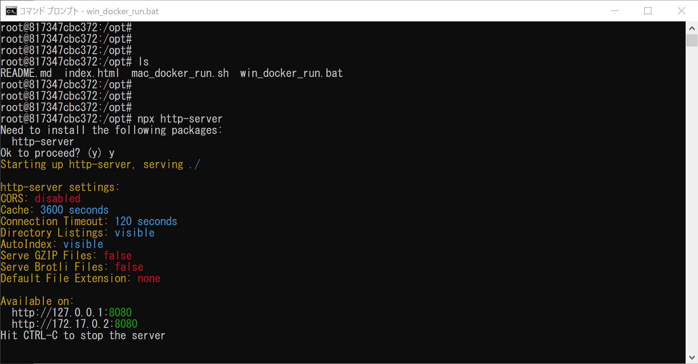

# p5js Projects
このリポジトリには、p5.jsのプログラムをローカルで動かすのに必要なものが入っています。
以下の手順でプロジェクトが動作することを確認してください。

## 動かし方
1. このリポジトリを「フォーク」して自分のアカウントにコピーする。
2. Visual Studio Codeを起動する。
3. 1でフォークしてできたリポジトリをクローンする。
4. Visual Studio Codeのターミナルメニューから「新しいターミナル」を実行します。
5. Windowsの方は"win_docker_run.bat"を実行（"win_docker_run.bat"と入力してENTER）し、Macの方は"mac_docker_run.sh"を実行（"zsh mac_docker_run.sh"と入力してENTER）します。
6. "root@8a4557ad22e9:/opt#"のような表示がでていることを確認する（root@の後のアルファベットと数字の部分はそれぞれで異なります）。
7. "npx http-server"を実行する。（"npx http-server"と入力してENTER）
8. "Ok to proceed? (y)"という表示がでたら、"y"を押す。
9. webサーバーの準備が実行され、"Hit CTRL-C to stop the server"が表示されたらwebサーバーの起動完了。

この時点で以下の表示になります（Windowsの場合）

10. ブラウザのアドレスバーに"http://localhost:8080/"を入力。
11. ブラウザの画面に表示されたプロジェクトのリストから「円を描くプロジェクト」を選択する。
10. マウスを動かすとたくさんの円が描かれることを確認してください。

## 終了方法
ターミナルでCtrl+cを押してサーバーを終了し、exitでDocker環境を終了します。
